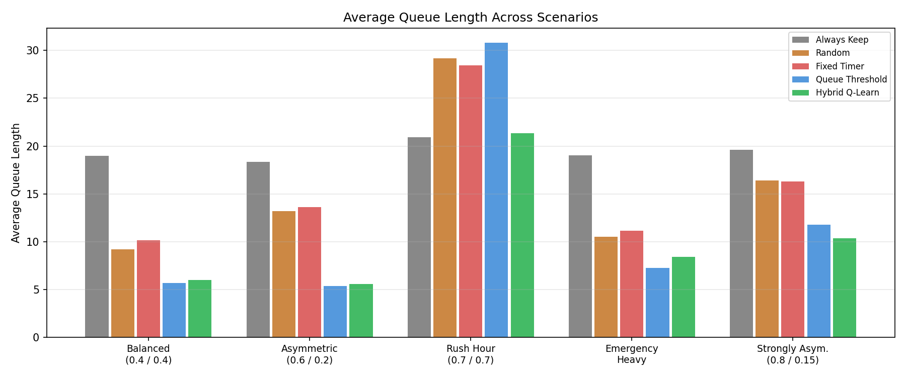
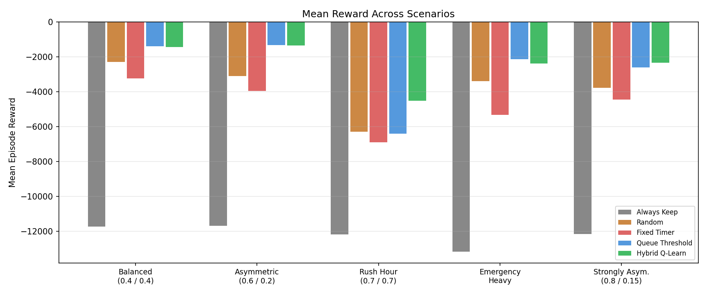
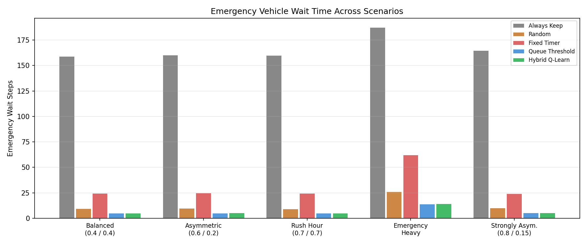
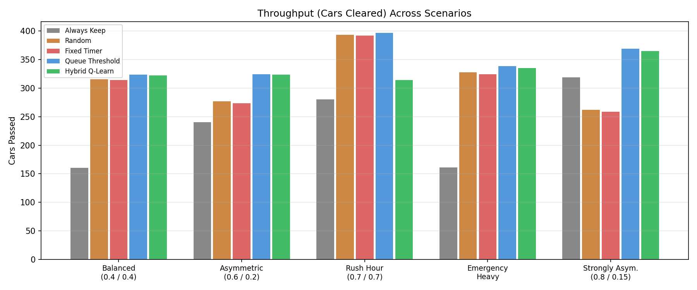
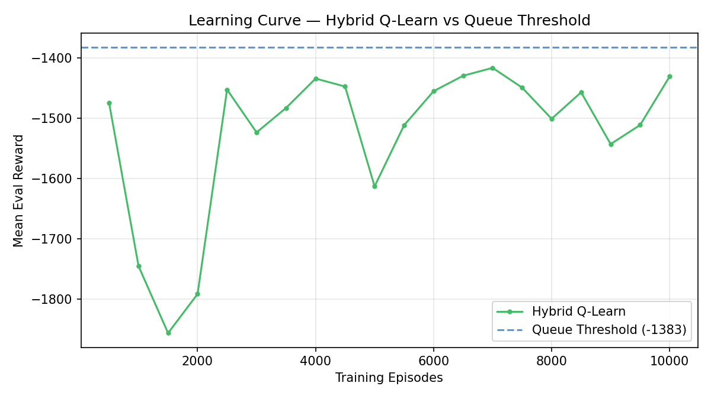
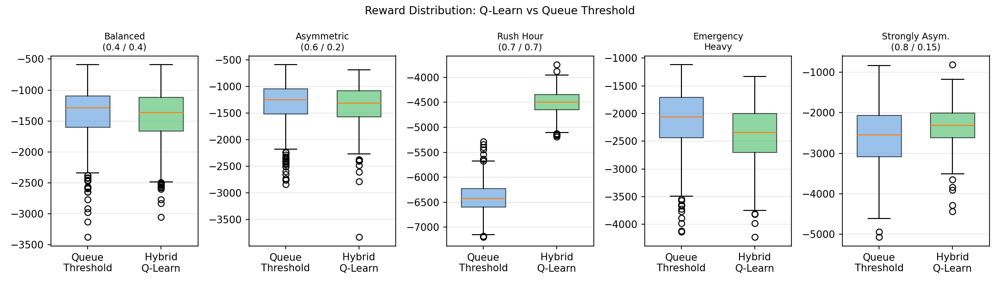

# Adaptive Traffic Light Control Agent

---

## Overview

This project develops an adaptive traffic light control agent for a simulated four-way intersection using reinforcement learning (RL), specifically tabular Q-learning. The agent learns to minimise queue lengths and waiting times by dynamically adjusting signal phases based on real-time traffic conditions.

The system extends beyond basic signal optimisation to handle emergency vehicles via a hybrid architecture that combines a learned Q-learning policy with a deterministic emergency override.

---

## Environment Design

### Intersection Model
- Four-way intersection with North, South, East, and West approaches
- Two signal phases: NS-green/EW-red and EW-green/NS-red
- Vehicle arrivals follow independent Poisson processes
- Queue lengths capped at 10 vehicles per lane

### State Space
A discrete 6-tuple: `(q_N, q_S, q_E, q_W, phase, emergency_lane)`

### Action Space
- `0` — maintain current phase
- `1` — switch to alternative phase

### Reward Function
```
reward = –(q_N + q_S + q_E + q_W) – 50 × I(emergency waiting at red)
```

---

## Agent Design

### Baseline Agents
| Agent | Description |
|-------|-------------|
| Fixed Timer | Switches phase every 10 timesteps |
| Queue Threshold | Rule-based; switches to the more congested axis |
| Always Keep | Never switches (lower bound) |
| Random | Switches with 50% probability (lower bound) |

### Q-Learning Agent
Tabular Q-learning with epsilon-greedy exploration:

```
Q(s,a) ← Q(s,a) + α × [r + γ × max_a′ Q(s′,a′) – Q(s,a)]
```

| Hyperparameter | Value |
|----------------|-------|
| Learning rate α | 0.1 |
| Discount factor γ | 0.95 |
| ε (start → end) | 0.3 → 0.01 |
| Training episodes | 10,000 |

### State Compression
Raw state space (146,410 states) is compressed to a 4-tuple:

```
(ns_bucket, ew_bucket, phase, emergency_axis)
```

This reduces the state space to **726 states** (200× reduction) while preserving decision-relevant information.

### Hybrid Architecture
1. If an emergency vehicle is waiting at red → immediately switch to give it green
2. Otherwise → follow the Q-learning policy on the compressed state

---

## Traffic Scenarios

| Scenario | NS Rate | EW Rate | Emergency Prob | Description |
|----------|---------|---------|----------------|-------------|
| Balanced | 0.4 | 0.4 | 5% | Equal demand, within capacity |
| Asymmetric | 0.6 | 0.2 | 5% | Moderate imbalance |
| Rush Hour | 0.7 | 0.7 | 5% | Demand exceeds capacity |
| Emergency Heavy | 0.4 | 0.4 | 15% | Frequent emergencies |
| Strongly Asymmetric | 0.8 | 0.15 | 5% | Extreme directional imbalance |

---

## Results

### Cumulative Reward (500 episodes, 200 timesteps each)

| Scenario | Always Keep | Random | Fixed Timer | Queue Threshold | Hybrid Q-Learn |
|----------|-------------|--------|-------------|-----------------|----------------|
| Balanced | -11729 | -2301 | -3235 | **-1383** | -1433 |
| Asymmetric | -11676 | -3112 | -3958 | **-1316** | -1359 |
| Rush Hour | -12173 | -6287 | -6904 | -6396 | **-4505** |
| Emergency Heavy | -13157 | -3397 | -5325 | **-2139** | -2380 |
| Strongly Asymmetric | -12145 | -3767 | -4457 | -2601 | **-2325** |

### Key Findings
- **Hybrid Q-Learn** achieves the best reward in Rush Hour (30% improvement over Queue Threshold) and Strongly Asymmetric scenarios
- **Queue Threshold** leads in balanced and moderate scenarios where reactive logic suffices
- Agents with emergency handling (Queue Threshold & Hybrid) achieve **4–5 emergency wait steps** vs. **24+** for Fixed Timer and **158–164** for Always Keep

### Result Plots

| Queue Comparison | Reward Comparison |
|-----------------|-------------------|
|  |  |

| Emergency Handling | Throughput |
|-------------------|------------|
|  |  |

| Learning Curve | Reward Distribution |
|---------------|---------------------|
|  |  |

---

## Project Structure

```
├── traffic_environment.py    # Four-way intersection simulation
├── q_learning_agent.py       # Tabular Q-learning agent
├── hybrid_agent.py           # Hybrid Q-learn + emergency override
├── fixed_timer_agent.py      # Fixed-timer baseline
├── queue_threshold_agent.py  # Rule-based threshold baseline
├── simulation.py             # Training and evaluation runner
├── evaluate.py               # Evaluation and plotting
├── test_environment.py       # Environment unit tests
└── results/                  # Generated plots
```

---

## How to Run

**Train and evaluate all agents:**
```bash
python simulation.py
```

**Run evaluation and generate plots:**
```bash
python evaluate.py
```

**Test the environment:**
```bash
python test_environment.py
```

---

## References

- Abdulhai et al. (2003). Reinforcement learning for true adaptive traffic signal control. *Journal of Transportation Engineering*, 129(3).
- Chu et al. (2020). Multi-agent deep reinforcement learning for large-scale traffic signal control. *IEEE Transactions on Intelligent Transportation Systems*, 21(3).
- Garg et al. (2018). Automatic traffic light control for emergency vehicles. *ICAART*.
- Mnih et al. (2015). Human-level control through deep reinforcement learning. *Nature*, 518.
- Wei et al. (2018). IntelliLight: A reinforcement learning approach for intelligent traffic light control. *KDD*.
- Wei et al. (2020). Recent advances in reinforcement learning for traffic signal control. *ACM SIGKDD Explorations*, 22(2).
- Wiering, M. (2000). Multi-agent reinforcement learning for traffic light control. *ICML*.
- Zheng et al. (2019). Learning phase competition for traffic signal control. *CIKM*.
